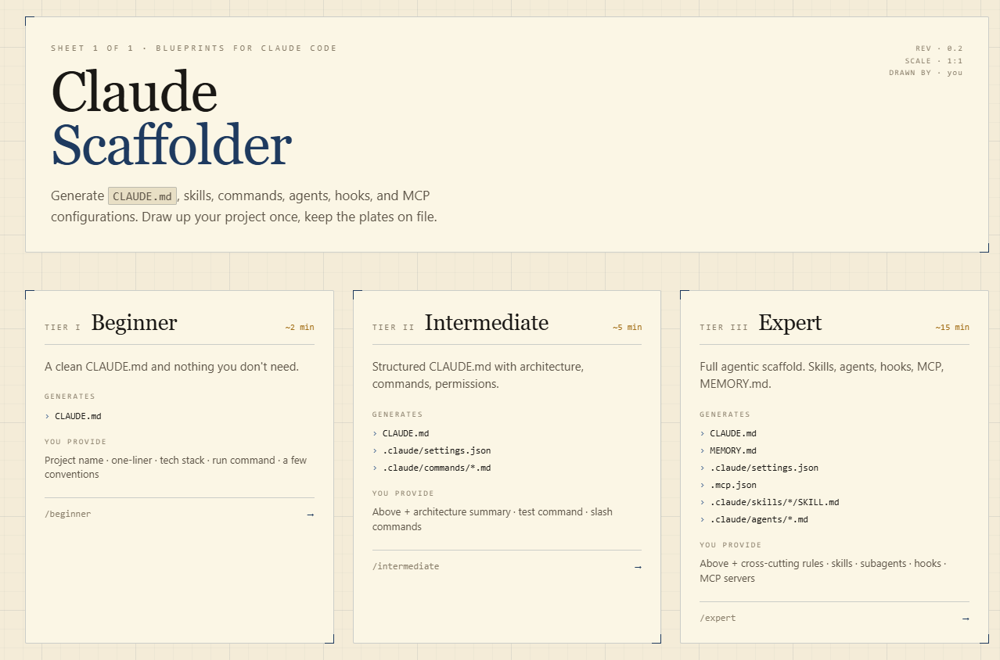
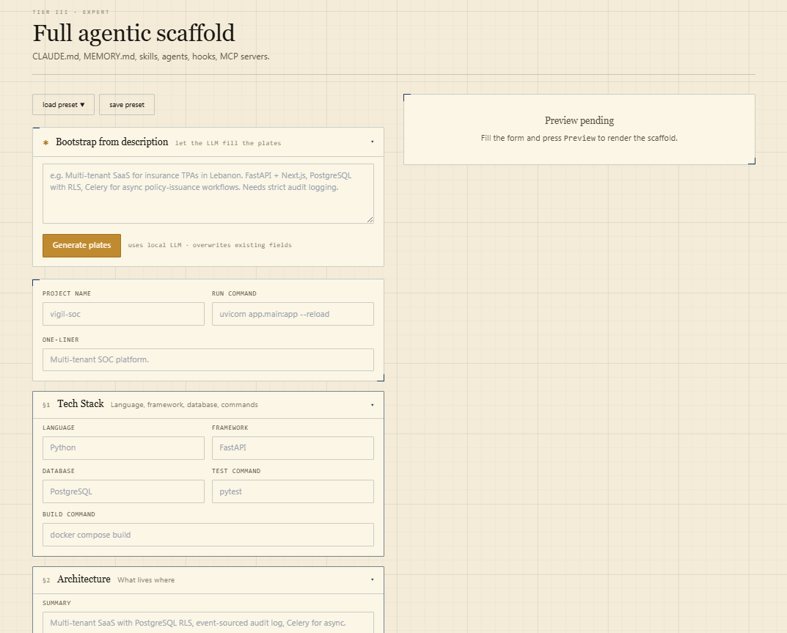
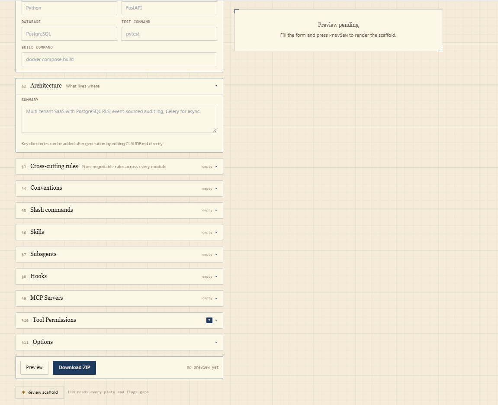

# Claude Code Generator

[](https://github.com/nasri82/claude-code-generator/actions/workflows/ci.yml)
[](LICENSE)

Generate production-ready Claude Code project scaffolds — `CLAUDE.md`, skills, slash commands, subagents, hooks, MCP configs, and `MEMORY.md` — from a web form, with optional LLM assistance.

Three tiers cover the full range from "just starting with Claude Code" to "running a multi-agent system with cross-cutting rules." A local LLM (Ollama by default) can fill the entire form from a one-paragraph description, suggest content for individual fields, or review your finished scaffold for gaps.

**Self-updating:** a built-in *What's New* panel tracks the upstream Claude Code changelog, lets you *apply* releases with one click, and the LLM extracts any new hook events, tools, or frontmatter fields into the feature catalog — new options appear in the form automatically, no code changes required.

---

## Screenshots

| Tier selector | Expert tier · bootstrap from description | Expert tier · form sections |
|:---:|:---:|:---:|
|  |  |  |

---

## Quick Start

### 1. Set up the LLM (optional but recommended)

The scaffolder works without an LLM — forms fill the templates directly. Hook up a local model for the magic.

**Ollama (recommended):**
```bash
# Install Ollama: https://ollama.com
ollama pull qwen2.5-coder:7b    # good balance of quality and speed (default)
# ollama pull qwen2.5-coder:14b # stronger, slower; better for expert-tier bootstrap
ollama serve                    # usually runs as a service already
```

**Any OpenAI-compatible endpoint works:** LM Studio, vLLM, llama.cpp server, or the OpenAI API itself. Set `LLM_BASE_URL` and `LLM_MODEL` in `.env`.

### 2. Copy environment template

```bash
cp .env.example .env
# Edit .env to match your setup (model name, base URL, etc.)
```

### 3. Run

**Option A — Docker (recommended):**
```bash
docker compose up --build
```

**Option B — Local:**
```bash
# Terminal 1 — backend
cd backend
python -m venv .venv && source .venv/bin/activate
pip install -r requirements.txt
uvicorn app.main:app --reload --port 8000

# Terminal 2 — frontend
cd frontend
npm install
npm run dev
```

Open http://localhost:3000.

Backend docs: http://localhost:8000/docs
LLM health check: http://localhost:8000/api/ai/health

---

## Tiers

| Tier | Generates | Use when |
|------|-----------|----------|
| **Beginner** | `CLAUDE.md` | New project, basic context for Claude Code |
| **Intermediate** | + `.claude/settings.json` + slash commands | Established project with patterns worth capturing |
| **Expert** | + `MEMORY.md` + skills + agents + hooks + `.mcp.json` | Production system with cross-cutting rules, multi-agent flows |

---

## LLM Features

### 1. Bootstrap from description (all tiers)

Expand the **✨ Describe your project** card above any tier's form. Type a paragraph describing your project. The LLM produces a fully-filled form matching the tier's schema. Review, edit, preview, download.

> *"Multi-tenant SaaS for insurance TPAs in Lebanon. FastAPI + Next.js, PostgreSQL with RLS, Celery for async policy-issuance workflows. Needs strict audit logging."*
>
> → Expert form with 6 cross-cutting rules across Security/Multi-tenancy/Observability, a sensible `MEMORY.md`, 3 slash commands, and an `audit-review` agent.

### 2. Field-level assist (expert tier)

Inline **✨ Assist** buttons populate specific heavyweight fields:
- Skill **body** from just a name + trigger description
- Agent **system prompt** from just a role
- **Cross-cutting rules** suggested from your tech stack
- Slash command **body** from just a name + description

### 3. Post-generation review (expert tier)

Click **✨ Review scaffold** under the form. The LLM reads all generated files and returns structured findings categorized as `missing`, `vague`, `risky`, or `praise`, each with a specific location and suggested fix.

### 4. Scaffold presets (all tiers)

Save the current form state as a named preset, then reload it on any new project. Presets are scoped per tier and persisted on disk (`backend/.presets.json`, gitignored). The `load preset` dropdown shows an active-preset badge next to the currently loaded one.

---

## What's New & Feature Catalog

### The What's New panel

Open from the status bar. The panel:

1. Fetches the Claude Code changelog from [GitHub](https://github.com/anthropics/claude-code/blob/main/CHANGELOG.md), parses it deterministically, and tags each item by heuristic relevance to the scaffolder (`high` / `medium` / `low` / `none`). No LLM required for this step — it's fast and always works.
2. Optionally refines a release with the local LLM — smaller prompt per release, so it's reliable on 7B models. Each release gets a short summary and a refined relevance tag.
3. Lets you **apply** a release — records adoption in `backend/.applied_releases.json` + a human-readable `APPLIED_RELEASES.md` log + extracts any new Claude Code features from the release text into the local feature catalog.

### The feature catalog

A single source of truth ships at [`backend/app/data/claude_code_catalog.json`](backend/app/data/claude_code_catalog.json). It declares everything the scaffolder knows about Claude Code:

| Section | Drives |
|--------|--------|
| `hook_events` | The *Event* dropdown in the expert hooks editor, the changelog-relevance parser's keyword list, and the What's New classify prompt |
| `built_in_tools` | The new **Tool Permissions** picker (intermediate + expert); allow/deny checkboxes derive from this list |
| `mcp_transports` | The MCP server *Type* dropdown |
| `frontmatter_fields` | Which YAML keys the skill / agent / command templates emit (`name`, `description`, `tools`, `model`, `allowed-tools`, …) |

Both the backend and the frontend read from `GET /api/catalog`. When Anthropic adds a new feature, there's exactly one place to update.

### User-local extensions

`backend/.claude_code_extensions.json` (gitignored) merges additively on top of the canonical catalog. When you *apply* a release, the LLM extracts any newly-introduced entries into this file and the catalog reloads in place — the new hook event, tool, or frontmatter field shows up in the form on the next render, with no restart and no code changes.

### LLM Networking Notes

| Your setup | `LLM_BASE_URL` |
|------------|----------------|
| Docker on Windows/Mac, Ollama on host | `http://host.docker.internal:11434/v1` |
| Docker on Linux, Ollama on host | Use host LAN IP, or run with `--network=host` |
| Backend local (uvicorn), Ollama on same machine | `http://localhost:11434/v1` |

The `docker-compose.yml` already sets `host.docker.internal` as the default. Override via `.env` if needed.

---

## Architecture

```
claude-code-generator/
├── backend/                              # FastAPI
│   ├── app/
│   │   ├── main.py                       # App + CORS + routers
│   │   ├── config.py                     # LLM env config + disk-persisted overrides
│   │   ├── data/
│   │   │   └── claude_code_catalog.json  # Single source of truth for Claude Code features
│   │   ├── routes/
│   │   │   ├── generate.py               # POST /api/generate/{tier} → ZIP
│   │   │   ├── preview.py                # POST /api/preview/{tier}  → JSON
│   │   │   ├── ai.py                     # POST /api/ai/{bootstrap,assist,review}
│   │   │   ├── config.py                 # GET/POST /api/config/llm
│   │   │   ├── catalog.py                # GET /api/catalog (merged canonical + extensions)
│   │   │   ├── presets.py                # CRUD /api/presets
│   │   │   └── whatsnew.py               # GET /api/whatsnew, /classify, /apply
│   │   ├── schemas/                      # Pydantic v2 per tier
│   │   ├── services/
│   │   │   ├── renderer.py               # Scaffold Jinja env
│   │   │   ├── packager.py               # build_{tier}() → ZIP
│   │   │   ├── prompts.py                # Prompt-template Jinja env
│   │   │   ├── llm.py                    # OpenAI-compat client (httpx)
│   │   │   ├── catalog.py                # Catalog loader + canonical/extensions merge
│   │   │   ├── catalog_extensions.py     # Write user-local extensions from release apply
│   │   │   ├── changelog_parser.py       # Deterministic changelog parser + heuristics
│   │   │   ├── applied_releases.py       # Persistent "applied" bookmark + markdown log
│   │   │   ├── frontmatter.py            # Build catalog-driven frontmatter blocks
│   │   │   └── presets.py                # Form-state preset storage
│   │   ├── templates/                    # Output templates per tier
│   │   │   ├── beginner/
│   │   │   ├── intermediate/
│   │   │   └── expert/                   # Agents / skills / commands use shared dict-driven frontmatter
│   │   └── prompts/                      # LLM prompt templates
│   │       ├── bootstrap.md.j2
│   │       ├── assist_*.md.j2
│   │       ├── review.md.j2
│   │       ├── whatsnew_classify_release.md.j2
│   │       └── whatsnew_extract_features.md.j2
│   ├── requirements.txt
│   └── Dockerfile
├── frontend/                             # Next.js 14 App Router
│   ├── src/
│   │   ├── app/
│   │   │   ├── page.tsx                  # Tier selector
│   │   │   ├── beginner/
│   │   │   ├── intermediate/
│   │   │   ├── expert/
│   │   │   ├── legend/                   # Concept reference (CLAUDE.md, skills, agents, ...)
│   │   │   └── settings/                 # LLM configuration UI
│   │   ├── components/
│   │   │   ├── PreviewPanel.tsx
│   │   │   ├── FieldArray.tsx
│   │   │   ├── BootstrapCard.tsx         # ✨ describe-your-project card
│   │   │   ├── AssistButton.tsx          # ✨ inline field assist
│   │   │   ├── ReviewPanel.tsx           # ✨ post-gen review
│   │   │   ├── WhatsNewPanel.tsx         # Changelog digest + apply
│   │   │   ├── PresetPicker.tsx          # Save / load named form state
│   │   │   ├── ToolsPicker.tsx           # Catalog-driven tool allow/deny grid
│   │   │   └── StatusBar.tsx
│   │   ├── lib/
│   │   │   ├── schemas.ts                # Zod mirror of Pydantic
│   │   │   ├── api.ts                    # preview + generate + API_BASE
│   │   │   ├── ai.ts                     # bootstrap + assist + review
│   │   │   ├── catalog.ts                # Feature catalog client (cached)
│   │   │   ├── presets.ts                # Preset CRUD client
│   │   │   ├── whatsnew.ts               # Changelog client
│   │   │   └── config.ts                 # LLM settings client
│   │   └── styles/
│   ├── package.json
│   └── Dockerfile
├── .github/workflows/ci.yml              # Typecheck + backend import + preview smoke tests
├── .env.example
├── docker-compose.yml
├── LICENSE
└── README.md
```

---

## Design Decisions

**OpenAI-compatible API, not Ollama-native.** The backend speaks `/v1/chat/completions`. Lets you swap Ollama for LM Studio, vLLM, or cloud without touching code.

**JSON mode with retry.** Bootstrap and cross-cutting-rules assist use `response_format: { type: "json_object" }`. On parse failure, one automatic retry with an explicit correction prompt. Still fails? Frontend shows the raw LLM output so you can see what went wrong.

**Pydantic validation of LLM output.** Every bootstrap response is validated against the same `ExpertInput`/`IntermediateInput`/`BeginnerInput` schema used by the form. Invalid output → 422 with structured error.

**Preview = Generate.** Both use the same `packager.build_{tier}()` code path. What you see in the preview panel is exactly what ends up in the ZIP.

**Strict templates.** Jinja `StrictUndefined` — missing context keys raise at render time rather than silently producing wrong output.

**Prompts as templates, not hardcoded strings.** All LLM prompts live in `backend/app/prompts/` as Jinja files. Iterate without touching Python.

---

## Extending

### Add a new Claude Code feature the scaffolder knows about (hook event, tool, MCP transport, frontmatter field)

Two options:

**Via the UI** — open *What's New*, find the release that introduced the feature, click **apply to application**. The LLM extracts new entries into `backend/.claude_code_extensions.json` and the catalog reloads in place. The entry shows up in the relevant form dropdown immediately.

**Manually** — add to [`backend/app/data/claude_code_catalog.json`](backend/app/data/claude_code_catalog.json):

```json
{
  "hook_events": [
    { "id": "AgentCheckpoint", "summary": "Fires when an agent checkpoints state", "since": "3.0" }
  ]
}
```

Restart the backend. The event now appears in:
- The hooks *Event* dropdown (expert tier)
- The changelog relevance parser's keyword list
- The LLM classify prompt's supported-events reference

### Add a new field to an existing tier

1. Add to `backend/app/schemas/{tier}.py`
2. Mirror in `frontend/src/lib/schemas.ts`
3. Add form input in `frontend/src/app/{tier}/page.tsx`
4. If it should appear in `.md` frontmatter, add the key to `frontmatter_fields.{kind}` in the catalog and to the matching Pydantic model — the shared dict-driven template picks it up automatically

### Add a new AI assist kind

1. Add a prompt template in `backend/app/prompts/assist_{kind}.md.j2`
2. Add the kind to the `Literal` in `routes/ai.py::AssistRequest`
3. Add the handler branch in `routes/ai.py::assist`
4. Wire an `<AssistButton kind="..." context={...} />` next to the target field

### Swap out the LLM

Change `LLM_BASE_URL` and `LLM_MODEL` in `.env`, or edit them live in **Settings** (changes persist to `backend/.llm_config.json` and survive restarts). No code change required as long as the endpoint is OpenAI-compatible.

---

## Troubleshooting

**"Could not reach LLM at ..."**
Check the output of `GET /api/ai/health`. Then confirm Ollama is running (`curl localhost:11434/api/tags`). If running inside Docker, make sure `LLM_BASE_URL` uses `host.docker.internal`, not `localhost`.

**"LLM output did not match the tier schema"**
The model returned JSON but it was structurally wrong. The error response includes the raw output. Try a stronger model (e.g. `qwen2.5-coder:14b` over `llama3.1:8b`), or lower temperature.

**Form empty after bootstrap**
The bootstrap response populated the form via `form.reset()`. Click **Preview** to render — the panel fills only on explicit preview to avoid spamming the backend.
